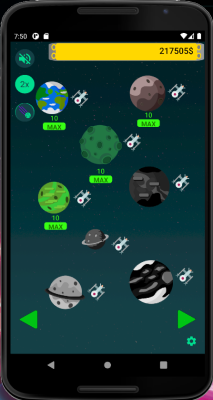
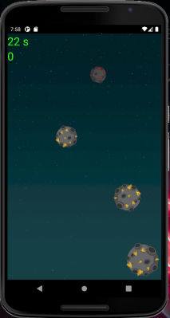

# Welcome to Spacefarm

Spacefarm is an android clicker game written in JAVA using Android Studio. This app was coded in Java while layouts were defined in xml.

Below is an example of the main screen:

In this application you can:
* tap planets to collect currency
* tap satellites to purchase upgrades for your planets such as the ability to autofarm
* play a minigame to collect meteors for more cash

The app also comes with a minigame where one taps falling meteors to collect extra cash

